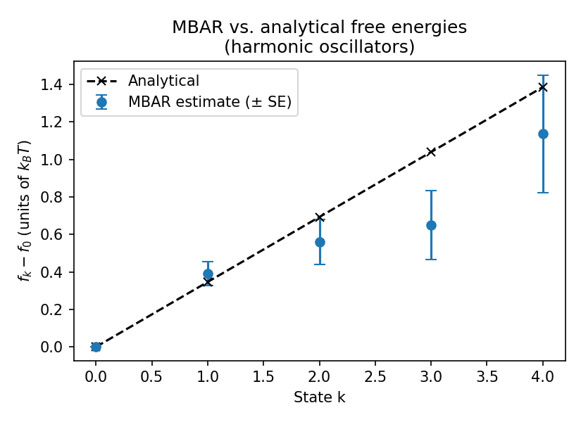
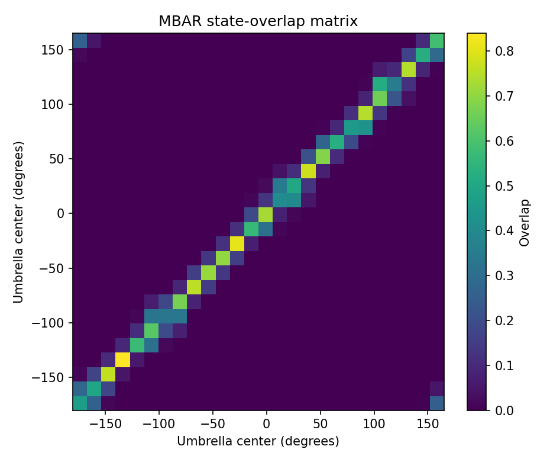
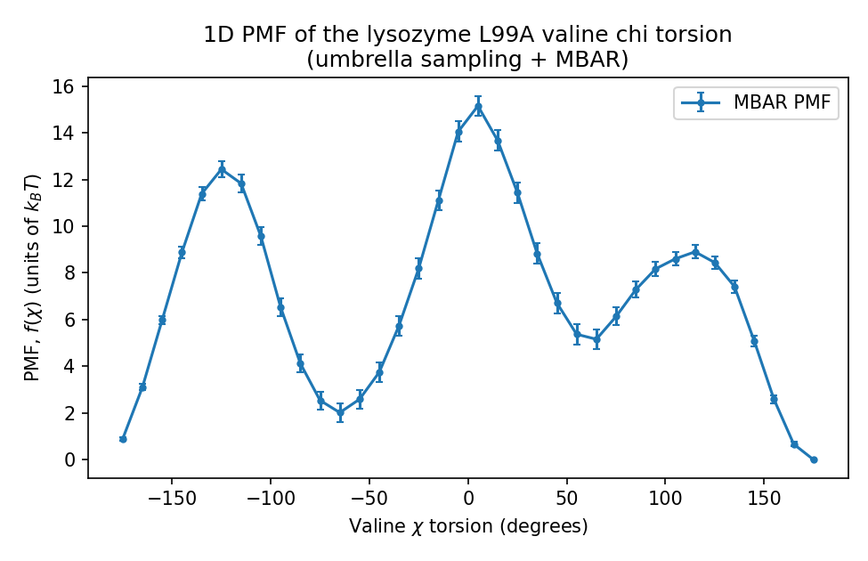
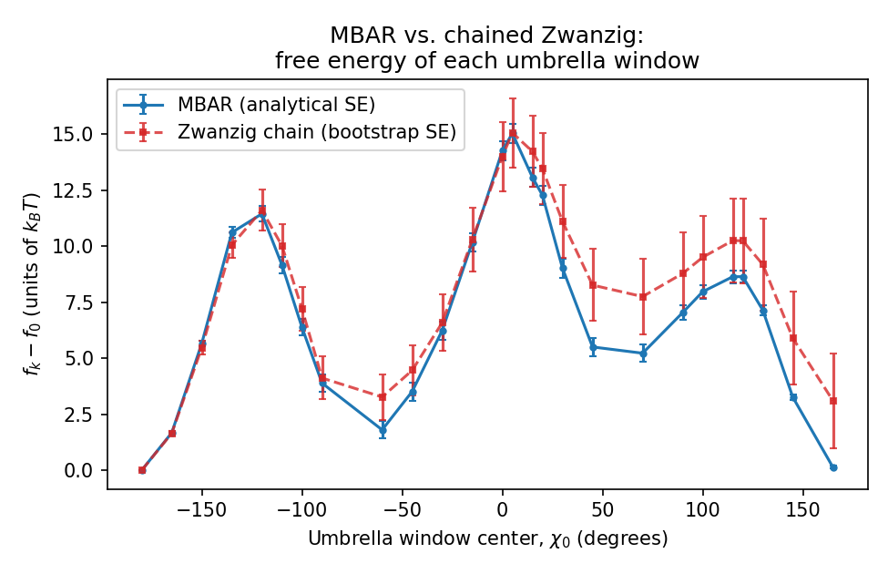

# Free Energy Estimation: MBAR & Zwanzig

[](https://github.com/annemcq/free-energy-mbar-zwanzig/actions/workflows/tests.yml)

This project compares single-step Zwanzig free-energy perturbation with Multistate Bennett Acceptance Ratio (MBAR). It first validates MBAR against an analytical harmonic-oscillator system, then applies both estimators to public umbrella-sampling data for a lysozyme chi torsion.

## Structure

```text
free-energy-mbar-zwanzig/
├── README.md
├── environment.yml
├── pytest.ini
├── data/
│   └── umbrella_lysozyme_chi/     # real umbrella-sampling data (see below)
├── src/
│   ├── mbar_estimator.py          # documented wrapper around pymbar.MBAR / FES
│   ├── zwanzig_estimator.py       # single-step FEP estimator + chained variant
│   ├── bootstrap.py               # generic per-state resampling bootstrap
│   └── umbrella_data.py           # parses the umbrella-sampling dataset, builds u_kln
├── notebooks/
│   ├── 01_validate_analytical.ipynb   # MBAR vs. harmonic-oscillator analytical solution
│   └── 02_lysozyme_pmf.ipynb          # real PMF, MBAR vs. Zwanzig, bootstrap error bars
├── tests/
│   ├── test_mbar_analytical.py
│   └── test_zwanzig_and_bootstrap.py
└── results/
    └── figures/
```

Run everything:

```bash
conda env create -f environment.yml
conda activate free-energy-mbar-zwanzig
pytest tests/
jupyter nbconvert --to notebook --execute --inplace notebooks/*.ipynb
```

## Part 1 — Validation against an analytical solution

`HarmonicOscillatorsTestCase` from `pymbar.testsystems` provides a set of harmonic oscillators with known closed-form free energies. `notebooks/01_validate_analytical.ipynb` and `tests/test_mbar_analytical.py` both check that `MBAREstimator` reproduces those free energies to within a few standard errors, before applying it to real data.



*MBAR's estimate (with standard error) tracks the analytical solution for every state.*

## Sampling overlap and estimator reliability

Before comparing free-energy estimates, the analysis now checks the statistical overlap between the umbrella windows using MBAR's state-overlap matrix. This provides a direct diagnostic of whether neighboring windows form a sufficiently connected sampling network.



The overlap analysis shows heterogeneous sampling connectivity: adjacent-window overlap ranges from 0.050 to 0.428 (median 0.150), with the weakest connection between the −150° and −135° windows. PyMBAR documents the overlap matrix as a diagnostic of how samples from one state contribute to other states, but does not prescribe a universal adjacent-overlap cutoff. I therefore use the observed weak link to flag where the chained Zwanzig estimate is most vulnerable rather than treating 0.050 as a formal pass/fail threshold.

## Part 2 — Real umbrella-sampling PMF: MBAR vs. Zwanzig

The real-data example uses the chi torsion of a valine sidechain in T4 lysozyme L99A with benzene bound in the cavity (Mobley et al., *J. Mol. Biol.* 371(4):1118-1134, 2007). The data come from the umbrella-sampling example distributed with `pymbar`.

`notebooks/02_lysozyme_pmf.ipynb`:

1. Loads the 26-window umbrella-sampling dataset (`src/umbrella_data.py`)
2. Subsamples each window for statistical independence (`pymbar.timeseries`)
3. Computes the 1D PMF with MBAR
4. Computes the relative free energy of each umbrella window with MBAR and a chained single-step Zwanzig estimator, then compares those window free energies
5. Estimates uncertainty in the Zwanzig chain by bootstrap resampling
6. Cross-checks MBAR's analytical uncertainty against a 100-replicate bootstrap
7. Quantifies agreement and uncertainty differences between the MBAR and Zwanzig profiles



*MBAR reconstruction of the one-dimensional free-energy profile along the chi torsion.*



### What is being compared?

The PMF is reported as a free-energy profile over **36 bins of the chi torsion**, while the MBAR-vs-Zwanzig estimator comparison is a comparison of the **26 umbrella-window free energies**. The chained Zwanzig calculation proceeds in one direction: for each adjacent pair, samples from window $k$ are used to estimate $f_{k+1}-f_k$, and those pairwise estimates are accumulated from the reference window.

### Quantitative comparison

The two estimators recover broadly similar free-energy profiles, but their uncertainty behaves very differently. MBAR's analytical standard errors agree closely with an independent bootstrap check (median bootstrap/analytical SE ratio = **1.017**, range **0.87–1.07**). Across the reaction coordinate, the chained Zwanzig profile differs from MBAR by an RMSE of **1.477 kBT**, with a maximum absolute difference of **2.973 kBT**. The median Zwanzig bootstrap standard error is **1.549 kBT**, compared with **0.366 kBT** for MBAR — approximately **4.23× larger** for the chained estimator.

This comparison illustrates the practical trade-off between the two approaches: Zwanzig can reproduce the overall profile but accumulates uncertainty as successive perturbation steps are chained, whereas MBAR uses information from all sampled states simultaneously.


*MBAR and the chained Zwanzig estimates agree closely over much of the umbrella-sampling range, particularly near the reference window. The bootstrap uncertainty of the Zwanzig chain increases as pairwise steps are accumulated, and differences of a few $k_BT$ appear for some later windows. MBAR retains smaller uncertainties by combining information from all sampled states in a single multistate estimate.*

## Notes

- Built with AI assistance.
- Uses only public data and public benchmark systems — no unpublished research data.
